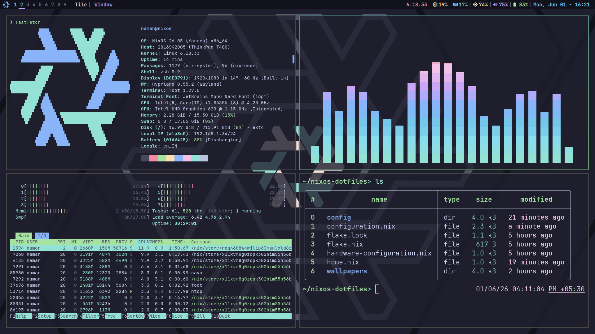

# NixOS Dotfiles

## ℹ️ Information

-   OS: [NixOS](https://nixos.org)
-   WM: [Hyprland](https://hyprland.org)
-   Colorscheme: [Catppuccin](https://catppuccin.com)
-   Terminal: [Foot](https://codeberg.org/dnkl/foot)
-   Shell: [zsh](https://www.zsh.org)
-   Text Editor: [Neovim](https://neovim.io)
-   Application Launcher: [tofi](https://github.com/philj56/tofi)
-   Font: [JetBrains Mono Nerd Font](https://github.com/ryanoasis/nerd-fonts)
-   Bar: [QuickShell](https://quickshell.org)
-   Browser: Firefox

## 📸 Screenshots

## 🗒️ License

[MIT LICENSED](./LICENSE)

